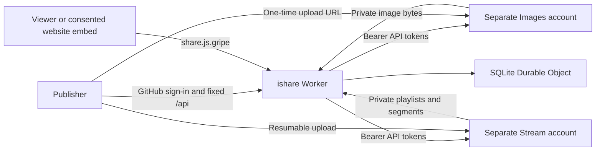

# ishare

Share images and videos with optional text, a stable share page, raw media links and attributed oEmbed embeds. Publishers sign in with GitHub; viewers need no account. Media is public and shareable.

[中文说明](docs/zh-cn.md) / [Quota and privacy operations](docs/operations.md)

[](https://deploy.workers.cloudflare.com/?url=https://github.com/jsw-teams/ishare)




## Deployment

Use Node 24, run `npm ci`, `npm run build`, `npm test`, then `npm run deploy`. The Cloudflare backend lives in `backend/cloudflare`. One Worker and one SQLite Durable Object hold application metadata; Images and Stream are accessed using API tokens, not resource bindings. They can belong to separate accounts.

Configure Worker Secrets: `IMAGES_ACCOUNT_ID`, `IMAGES_API_TOKEN` with Images Read/Write; `STREAM_ACCOUNT_ID`, `STREAM_API_TOKEN` with Stream Read/Write; and `STREAM_CUSTOMER_CODE`. Only configure the media type you intend to enable. No image variants or image signing key setup is needed: image delivery proxies the authenticated Images blob endpoint. Stream uses a cached token API by default; optional `STREAM_SIGNING_KEY_ID` and base64 JWK `STREAM_SIGNING_KEY` avoid playback token API requests.

GitHub login needs `GITHUB_CLIENT_ID`, `GITHUB_CLIENT_SECRET` and callback `https://share.js.gripe/auth/callback`. Do not reuse or change another service's callback silently. Set `SITE_ORIGIN`, `WEBSITE_ORIGINS`, and your **verified numeric** `OWNER_GITHUB_ID`; this deployment uses `228026986` for the current operator. Forks must replace it. Optional `ADMIN_IDS` delegates moderation without making those accounts unlimited. Empty `PUBLISHER_IDS` allows authenticated users within their quotas.

`workers.dev` and preview URLs are disabled. The operator configures `share.js.gripe` routes; deployment does not create routes or replace website Workers. Hosted Images/Stream resources require the corresponding Cloudflare plans; the deploy button does not supply free media storage or credentials.

## Quotas and administration

The ordinary-user defaults are 300 images stored, 10,000 images delivered per UTC month, 10 video minutes stored, 100 video minutes delivered per UTC month, 50 uploads per UTC day, 120 seconds per video, and 1 GiB per video. These are application policy defaults, not a Cloudflare free tier. The operator is exempt from all application quotas, including global application budgets. Provider upload/encoding limits still apply: Images accepts at most 10 MB and Stream files must be below 30 GB.

After operator login, **User management** appears on the homepage. Select a user to increase individual limits, leave limits blank for unlimited, suspend publishing, restore defaults, inspect media, or remove an individual item. All quota and permission changes require a user-visible reason. Ordinary reductions and suspension receive seven days of notice; explicit urgent abuse restrictions apply immediately. Existing content is not deleted by quota changes. Export, deletion and privacy requests remain available while publishing is suspended.

Global non-operator budgets are configured with `MAX_IMAGES`, `MAX_VIDEO_SECONDS`, `MAX_UPLOADS_PER_DAY`, `MAX_IMAGE_DELIVERIES`, and `MAX_VIDEO_DELIVERY_SECONDS`; per-user defaults may be configured using `QUOTA_` followed by the documented field name. A user-specific increase remains subject to the shared non-operator budget. See [operations](docs/operations.md) for exact accounting, caching and privacy procedures.

## Website integration

Register a flat consent service with `provider: oembed`, `backendUrl: https://share.js.gripe`, a localized name/purpose, data/recipient/retention disclosures and `privacyUrl: https://share.js.gripe/privacy.html`. On an EdgePress page:

```yaml
blocks:
  - columns: 1
    cells:
      - - type: oembed
          integration: ishare
          url: https://share.js.gripe/s/REPLACE_WITH_REAL_SHARE_ID
          title: Shared image or video
```

EdgePress waits for current service consent **and** a visitor click. Metadata uses fixed `/api` with `X-Service-Action: oembed` and `X-Service-Resource` headers. Standard consumers can use `/oembed?url=...`; the standard protocol is an explicit exception to business API header routing. Media delivery URLs contain opaque application IDs and encrypted HLS resource tickets, never provider IDs or original delivery URLs. One-time direct upload URLs are visible to the authenticated uploader, and grant neither account access nor playback access.

Hashed CSS, JavaScript and bundled HLS dependencies cache for one year. Public media caches for up to five minutes; HTML for thirty seconds. Sessions, administration and rights requests are never publicly cached. No external player CDN, analytics, advertising, paywall or blurred-media flow is included.

## Verification

`npm test` checks ownership, CSRF, direct-upload token handling, atomic quotas, operator exemption, quota notices, suspension/appeal/export/erasure, HLS URL rewriting, browser administration, and real Cloudflare SQLite/RPC/static routing. Browser tests use local fixtures; they do not certify real provider uploads or account configuration.
