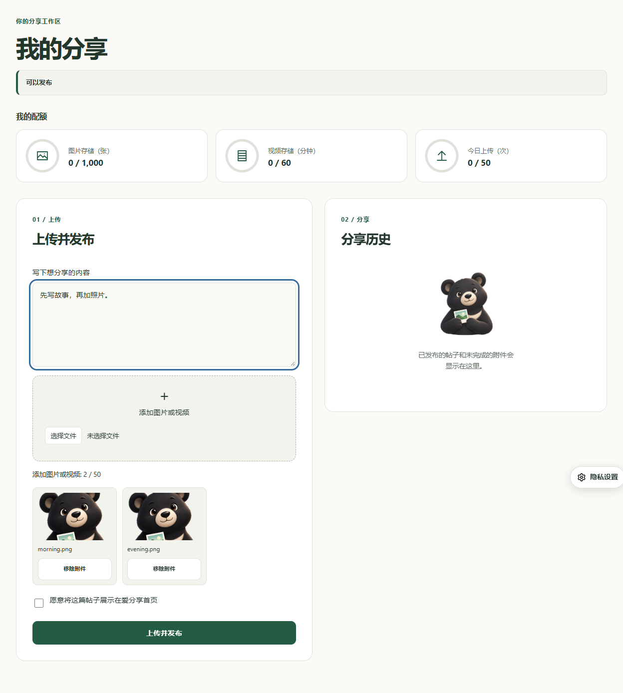
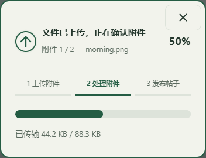
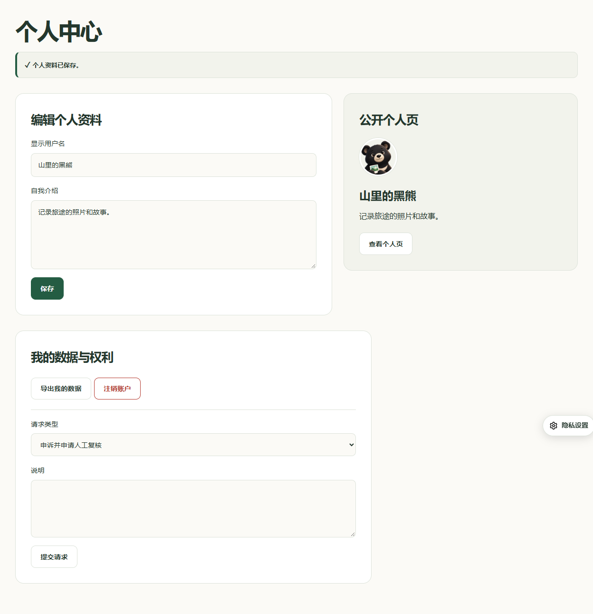
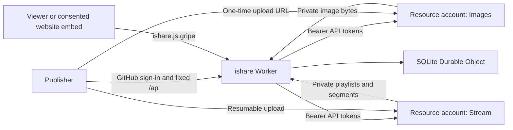

# ishare

English is the default language at the site root. Traditional and Simplified Chinese remain available at /zh-TW/ and /zh-CN/.

Write a story first, then add multiple image or video attachments. Publish complete attributed oEmbed posts or individual Markdown image links. The homepage lists only posts explicitly opted in by their publishers; My shares contains the composer, graphical quota usage and personal history. Post avatars link to public author profiles with introductions and published posts. Publishers sign in with GitHub; viewers need no account. Media is public and shareable.

[中文说明](docs/zh-cn.md) / [本站配置说明](docs/configuration.md) / [Quota and privacy operations](docs/operations.md)

[](https://deploy.workers.cloudflare.com/?url=https://github.com/jsw-teams/ishare)











## Deployment

The JS.GRIPE operator deploys the existing Worker from the private `jsw-teams/web` repository, root `/ishare.js.gripe`. This public repository distributes complete ishare application source; EdgePress is a pinned dependency, without a copied framework source tree. See the [configuration guide](docs/configuration.md) for Git build settings and runtime Secrets.

Use Node 24, run `npm ci`, `npm run build`, `npm test`, then `npm run deploy`. The Cloudflare backend lives in `backend/cloudflare`. One Worker and one SQLite Durable Object hold application metadata; Images and Stream are accessed using API tokens, not resource bindings. Images and Stream use one resource account for this deployment.

Configure runtime `STREAM_ACCOUNT_ID` (Variable or Secret) for both Images and Stream, and one `MEDIA_API_TOKEN` with Images Edit and Stream Edit on that resource account. Remove obsolete `IMAGES_ACCOUNT_ID`, `STREAM_CUSTOMER_CODE` and manually configured signing keys. Stream playback addresses and tokens are discovered using its authenticated API and cached on the server. The backend configures private signed image variants (640, 1280 and 2048 pixel bounds), selects the display size and format, and proxies delivery. Original bytes load only when the image viewer is opened or saved. No general platform binding is needed.

Video playback and image viewing use the open-source [media-viewer component](https://github.com/jsw-teams/media-viewer). Player controls adapt to mobile screens. Image, gallery, quota and upload icons use locally shipped Lucide SVGs under the ISC license; unused refresh controls are removed. Images open a full-screen viewer with zoom, pan, save and close controls; closing restores the page and keyboard focus. HLS loading starts on play and pauses future segment requests on pause.

GitHub login needs `GITHUB_CLIENT_ID`, `GITHUB_CLIENT_SECRET` and callback `https://ishare.js.gripe/auth/callback`. Do not reuse or change another service's callback silently. The backend derives its origin from the routed request and does not need origin variables. Public metadata allows cross-site reading; login and writes retain same-origin and CSRF checks. Configure the static canonical URL in `config.yml` and your **verified numeric** `OWNER_GITHUB_ID`; this deployment uses `228026986` for the current operator. Forks must replace it. Optional `ADMIN_IDS` delegates moderation without making those accounts unlimited. Empty `PUBLISHER_IDS` allows authenticated users within their quotas.

`workers.dev` and preview URLs are disabled. The operator configures `ishare.js.gripe` routes; deployment does not create routes or replace website Workers. Hosted Images/Stream resources require the corresponding Cloudflare plans; the deploy button does not supply free media storage or credentials.

## Quotas and administration

The ordinary-user defaults are 1,000 images stored, 60 video minutes stored, 50 uploads per UTC day, 10 minutes per video. Image delivery counts and delivered video duration are operator monitoring metrics, with no ordinary-user delivery caps. These are application policy defaults, not a Cloudflare free tier. The operator is exempt from all application quotas, including global application budgets. Provider upload/encoding limits still apply: Images accepts at most 10 MB and Stream files must be below 30 GB.

The avatar dropdown opens **Personal center**, **Administration** for administrators, and **Sign out**. Personal center at `/profile/` edits display name and biography with a preview and contains data export, rights requests and account closure. Public `/u/<numeric ID>` pages list published posts whether or not they appear on the homepage.

After operator login, the separate **Administration** page at `/admin/` contains **User management**. Select a user to increase individual limits, leave limits blank for unlimited, suspend publishing or public sharing for documented abuse, restore defaults, inspect media, or remove an individual item. All quota and permission changes require a user-visible reason. Ordinary reductions and suspension receive seven days of notice; explicit urgent abuse restrictions apply immediately. Existing content is not deleted by quota changes. An explicit sharing suspension stops new public delivery without deleting stored media; it follows the same reason, notice and appeal policy. Export, deletion and privacy requests remain available while publishing is suspended.

The verified GitHub operator edits **Platform quotas** online: new-user defaults and shared non-operator storage/allocation budgets are saved in SQLite, without quota environment variables. Existing users keep their effective and scheduled quotas when new-user defaults change. Shared-capacity reductions receive seven days of notice unless urgent abuse handling is explicitly selected. User-specific increases remain subject to shared capacity; per-user changes continue through User management. See [operations](docs/operations.md) for accounting, caching and privacy procedures.

## Website integration

Register a flat consent service with `provider: oembed`, `backendUrl: https://ishare.js.gripe`, a localized name/purpose, data/recipient/retention disclosures and `privacyUrl: https://ishare.js.gripe/privacy.html`. On an EdgePress page:

```yaml
blocks:
  - columns: 1
    cells:
      - - type: oembed
          integration: ishare
          url: https://ishare.js.gripe/s/REPLACE_WITH_REAL_SHARE_ID
          title: Shared image or video
```

EdgePress waits for current service consent **and** a visitor click. Metadata uses fixed `/api` with `X-Service-Action: oembed` and `X-Service-Resource` headers. Standard consumers can use `/oembed?url=...`; the standard protocol is an explicit exception to business API header routing. Media delivery URLs contain opaque application IDs and encrypted HLS resource tickets, never provider IDs or original delivery URLs. One-time direct upload URLs are visible to the authenticated uploader, and grant neither account access nor playback access.

Hashed CSS, JavaScript and bundled HLS dependencies cache for one year. Public media caches for up to five minutes; HTML for thirty seconds. Private page bootstrap reads session and initial page data in one authorized DO call. Hidden admin sections load on demand; identical in-flight reads share one request. Sessions, administration and rights requests are never publicly cached. Missing or unavailable upstream media shows an accessible placeholder and explicit retry on cards, share pages and embeds, preserving text and other attachments. Delivery failures do not erase records or alter storage quotas. No external player CDN, analytics, advertising, paywall or blurred-media flow is included.

## Verification

`npm test` checks Images publication using the current API `meta` response field, byte-based image upload progress, centered-modal cancellation and rollback of this attempt’s attachments, isolated media deletion/network failure feedback and recovery, single-call page bootstrap with authorization and in-flight request deduplication, plus ownership, CSRF, direct-upload token handling, atomic quotas, operator exemption, quota notices, suspension/appeal/export/erasure, HLS URL rewriting, browser administration, and real Cloudflare SQLite/RPC/static routing. Browser tests use local fixtures; they do not certify real provider uploads or account configuration. Mobile quality fixtures cover light/dark 320 px and 390 px pages with delayed account responses, plus signed-in quota, administration and profile screens at 320 px and desktop width. They check axe WCAG rule tags, horizontal overflow and layout shifts. Shared viewer tests cover portrait and landscape touch controls, dialog focus, and delayed original loading. Reports are written to `.wrangler/quality/`; automated checks do not replace testing with physical devices and assistive technology.

## Source and deployment

The canonical application directory is `web/ishare.js.gripe`. The `jsw-teams/ishare` repository receives the complete deployable source from that directory, including EdgePress pages and `/backend/cloudflare`. The operator Worker builds from the private `jsw-teams/web` repository with root directory `ishare.js.gripe`, running `npm ci` and `npm run deploy`. The public ishare repository distributes the same complete source; it is not the operator Worker deployment source. No cross-repository frontend download or public release artifact is required. Configure actual credentials only as Worker Secrets.

Configure the operator deployment using the [Chinese configuration guide](docs/configuration.md). EdgePress is a pinned dependency; its framework source is not copied into this project.

Failed uploads and exact metadata-matched duplicate allocations are removed automatically without manual reconciliation. One-time DO alarms run only while pending uploads/removals/erasure exist; no cron runs while idle. Restricted sign-ins go to `/appeal/`; other data rights remain in `/profile/`. Native file-control chrome, playback controls and confirmation popups use the local site UI. Video cards show proxied thumbnails and selected videos show a real local preview frame.
