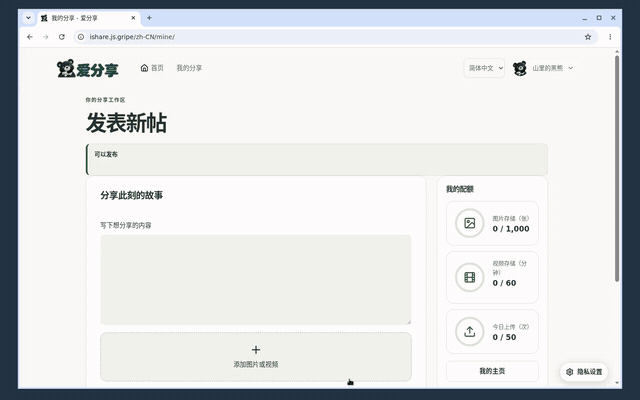
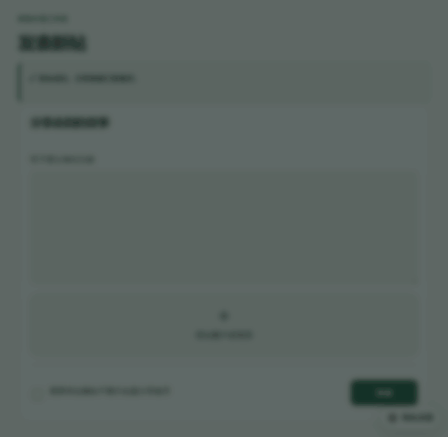
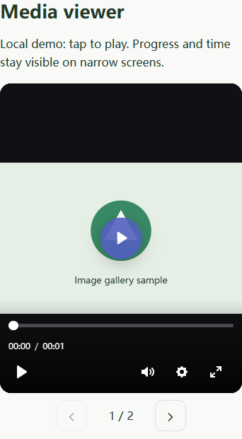
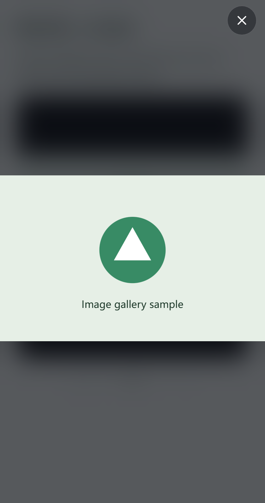

# 爱分享 中文说明

爱分享用于公开分享图文和视频。上方编辑文字，下方添加最多 50 个图片或视频附件。“我的分享”专注于发布与图形化配额，历史和本人删除管理统一放在个人主页；首页仅展示发布者主动勾选愿意展示的帖子。可分享完整帖的 oEmbed 嵌入代码，也可复制逐张图片的 Markdown 链接。发布者使用 GitHub 登录；访客无需登录即可访问分享页或查看嵌入。内容保留作者署名，不提供付费查看或模糊预览。

插入写文建站的文章时，访客授权后按可见位置自动加载。嵌入媒体的配色跟随文章主题，高度随实际内容展开，附件切换按钮和完整正文不再被固定外框裁切；来自其他窗口的消息不会改变嵌入界面。












预览图根据可用网络信息选择合适尺寸，并按需懒加载。点击后才请求完整原图，慢速传输不会因等待响应头的超时设置被截断。轻透查看器只保留独立叉号；点击、滚轮或双指缩放，放大后拖动；键盘 +、- 缩放，0 重置，方向键移动。保存使用浏览器的图片菜单。

播放器跟随页面配色，当前时间和总时长放在一起，进度条独立一行。支持 MSE 的浏览器使用自适应加载，先获取较小的可播放分片，再按网速与显示尺寸调整细节；倍速播放会相应调整码率选择和有上限的前向缓冲。封面和已保存的总时长可在播放前显示，视频分片仍在点击播放后才请求。

预览图按可用网络信息选择范围：慢速或省流量模式使用 640 像素，普通或未知网络允许 1280 像素，较快网络允许 2048 像素，浏览器再根据显示尺寸选择。卡片仍懒加载，附件数量与视频提示位于图片下方。点开放大仍请求未缩小的原图。回源超时只限制等待响应头，开始传输后不再被固定 20 秒截断；能否逐步显示取决于图片格式和浏览器。

## 个人中心与公开个人页

点击右上方头像展开“个人中心”、管理员专属“管理后台”和“退出登录”。个人中心支持编辑显示用户名与自我介绍，实时预览并保存；GitHub 数字身份与登录用户名保持不变。“我的数据与权利”也在个人中心，可导出 JSON、提交请求与注销账户。

点击帖子作者头像进入 `/u/数字用户ID` 个人页，显示头像、介绍和历史公开图文帖。首页展示勾选只决定首页动态，未勾选的已发布帖子仍会显示在作者个人页；草稿、已删除及暂停公开分享的帖子不显示。账户注销会立即停止个人页公开访问，随后按既有流程清理媒体和个人资料。

发布时，当前页持续显示附件名称、总字节进度、百分比与已传输量，并分别提示准备、上传、确认和发布阶段。图片进度来自浏览器的实际传输事件；上传到 100% 后仍需确认附件与发表帖子。失败会撤销本次新附件，不留下需要手动对账的上传记录；已复用附件保留。

“我的分享”用图片、视频和上传图标及进度环展示已用与总额度；不限显示明确文字，不伪造百分比。后台分为平台配额、用户、请求与申诉、管理记录，选中项和保存结果有明确视觉反馈。

## 部署与资源接入

使用 Node 24，执行 `npm ci`、`npm run build`、`npm test`、`npm run deploy`。后端代码位于 `/backend/cloudflare`。Worker 保存配置并通过一个 SQLite Durable Object 保存业务资料；Images 和 Stream 通过 **API Token** 接入，共用一个资源 Cloudflare 账户。没有 Images/Stream 的 Worker binding。

在 Worker 的运行时配置中添加一份 `STREAM_ACCOUNT_ID`（可用普通 Variable 或 Secret），以及共用的 `MEDIA_API_TOKEN` Secret（对实际资源账户授权 Images Edit 和 Stream Edit）。删除旧 `IMAGES_ACCOUNT_ID` 和 `STREAM_CUSTOMER_CODE`，不再兼容读取旧名称；播放器地址由 Stream API 获取。后端自动配置 640、1280、2048 像素范围的私有签名图片变体，按显示尺寸和浏览器格式能力代理加载。点击图片打开查看器或保存时才请求原图。视频在服务端缓存 API 取得的签名播放地址和令牌，无需手填签名密钥。

视频播放器与图片查看器使用独立开源的 [media-viewer 组件](https://github.com/jsw-teams/media-viewer)。手机播放器的进度条、当前与总时长、操作栏分行显示。帖子先按需加载优化图，点击后才加载并显示原图，可缩放、拖动、保存，通过叉号或 Escape 关闭后返回原位置。原图加载期间显示加载状态。视频封面预先加载，总时长来自已保存的附件资料；点击播放后才加载分片，暂停后停止后续分片请求。封面由服务端取第 1 秒画面并保存复用，不裁切竖屏画面；不足 1 秒的视频取首帧，已有指定封面保留。

GitHub 登录需要 `GITHUB_CLIENT_ID`、`GITHUB_CLIENT_SECRET`，回调地址为 `https://ishare.js.gripe/auth/callback`。其他服务的 GitHub App 回调不应被自动修改。业务域名从请求自动取得，无需额外域名变量；静态页面网址在 `config.yml` 配置，路由由你自行配置；`workers.dev` 与预览域名关闭。托管 Images/Stream 需要相应的平台计划，一键部署不会提供免费的媒体额度或自动继承其他 Worker 的 Secrets。

## 配额与后台管理

| 普通用户额度 | 默认值 |
| --- | ---: |
| 图片存储 | 1,000 张 |
| 图片传递 | 不设常规额度，后台统计次数 |
| 视频存储 | 60 分钟 |
| 视频传递 | 不设常规额度，后台统计时长 |
| 上传频次 | 每日 50 次 |
| 单个视频 | 初始最长 10 分钟；文件仅受平台硬限制 |

后台按 UTC 日历月统计传递用量，不因普通浏览热度停止分享。视频上传先预留预计时长，发布时改用 Stream 确认的实际时长。传递时长按真实请求的 HLS 分片统计，预加载、重复请求也会记入用量。文件体积仅用于上传检查，不混作视频计费储存额度。

运营者 GitHub 数字 ID 配置为 `OWNER_GITHUB_ID=228026986`，免除所有应用配额及共享预算限制。不能仅根据用户名认定身份。Cloudflare 的硬性文件与编码限制仍然存在，图片最大 10 MB、视频需小于 30 GB。普通账户的默认共享预算为 10,000 张图片、600 分钟视频与每日 500 次上传。其他用户提高额度时仍受共享预算控制；在“管理后台 → 平台配额”通过 GitHub 运营者账户在线调整，不使用配额系统变量。新用户默认额度变更保留已有用户额度；共享容量普通降低提前七天通知。

登录后，运营者可从头像下拉菜单的“管理后台”进入独立的 `/admin/` 页面，并在“用户管理”选择账户。可单独调整图片数量和视频储存分钟数；图片传递次数及视频传递时长仅用于后台监控，不设常规访客额度。留空表示不限，零表示停止对应的新使用。对明确滥用可暂停新上传、发布及公开分享，保留资料供本人导出、删除和申诉；也可恢复默认额度、查看媒体及删除具体内容。额外管理员用 `ADMIN_IDS` 的数字 ID 配置，他们不会因此自动获得无限额度。

降低配额或普通暂停需要填写对应用户可见的原因，并提前七天在站内通知。已有内容不自动删除；超过新额度时停止继续分配。紧急滥用可明确选择立即暂停，仍保留人工申诉、数据导出、本人删除和隐私请求入口。七天是本站运营规则，**不是 GDPR 规定的配额调整期限**。

隐私请求按一个日历月设置答复期限，后台列出待处理请求。管理员需要实际复核与处理，不能只点“答复”即认定已履行权利请求。账户删除会先停止公开访问，再移除上游媒体及账户资料；删除失败会重试，未知上传需要管理员核对。界面会保持“正在删除”，不能将未完成的删除标成完成。

数据导出提供 JSON 资料与媒体链接，不是原始视频文件备份。普通媒体删除记录最长保留三十天，管理及已答复请求记录最长九十天；账户删除完成时会提前清除关联资料。媒体缓存最长五分钟，第三方自行保存的副本无法召回。隐私联系：**helper@js.gripe**。

完整的计费差异、免费图床参考及 GDPR 运营流程见 [operations.md](operations.md)。这些措施支持 GDPR 权利处理；还需要运营者完成适用法律、处理依据、供应商协议与真实请求处理，不能仅凭代码宣称已认证合规。

## 写文建站页面嵌入

在 `config.yml` 的 `plugins.consent.services` 注册 `provider: oembed` 的 ishare 服务，并填写实际用途、接收方、资料类别、保存时间和隐私页地址。页面 YAML：

```yaml
blocks:
  - columns: 1
    cells:
      - - type: oembed
          integration: ishare
          url: https://ishare.js.gripe/s/替换为真实分享ID
          title: 图片或视频说明
```

需要访客授权该服务并点击“加载媒体”才发起请求。业务接口固定为 `/api`，操作名和资源 URL 在 HTTP 请求头传递。其他 oEmbed 客户端可使用标准 `/oembed` 发现接口。浏览器播放与查看只看到 `ishare.js.gripe` 的代理地址，HLS 内部资源也会重写；上传者会看到有时效的一次性上传地址，该地址不是账户凭据或播放地址。

## 前端与部署来源

源码在 `web/ishare.js.gripe` 维护，完整部署目录直接同步到 `jsw-teams/ishare` 仓库。前端采用 EdgePress，后端位于 `/backend/cloudflare`。实际 Worker 从私有 `jsw-teams/web` 仓库构建，根目录填写 `ishare.js.gripe`，运行 `npm ci` 与 `npm run deploy`。公开 ishare 仓库仅分发完整源码，不作为本站 Worker 的部署源；不再跨仓库下载页面，也不发布公开前端构建资源。敏感环境只填写 Worker Secrets。

逐项配置请参考 [configuration.md](configuration.md)。EdgePress 通过固定版本依赖引用，不在公开 ishare 仓库重复发布生成器源码。


动态页面合并首屏读取，后台栏目按需加载；资源被删除或回源失败时显示占位和重新加载按钮，保留帖子文字与其他附件。失败不会自动删除真实记录。

上传弹窗显示真实进度，叉号取消并移除本次新附件。失败自动撤销，不要求手动对账；正常分享与复用附件保留。视频使用真实本地帧预览及本站代理的公开预览图。取消 cron，仅有未完成清理任务时运行一次性 DO alarm，完成即停止。限制账户进入独立申诉页 `/appeal/`；数据与权利仍在个人中心。

帖子仅包含正文和附件，不设独立标题。首页与个人页卡片只加载首个附件；点击进入详情后，使用左右按钮、键盘方向键或横向滑动切换，下一项在切换时加载，视频离开当前项时停止。个人页展示头像、显示名、简介与公开帖子，不展示 GitHub 账号标签。处理附件时返回 202 并自动等待；删除请求立即撤下帖子并刷新列表，源站附件在后台按最多四个并行清理。
