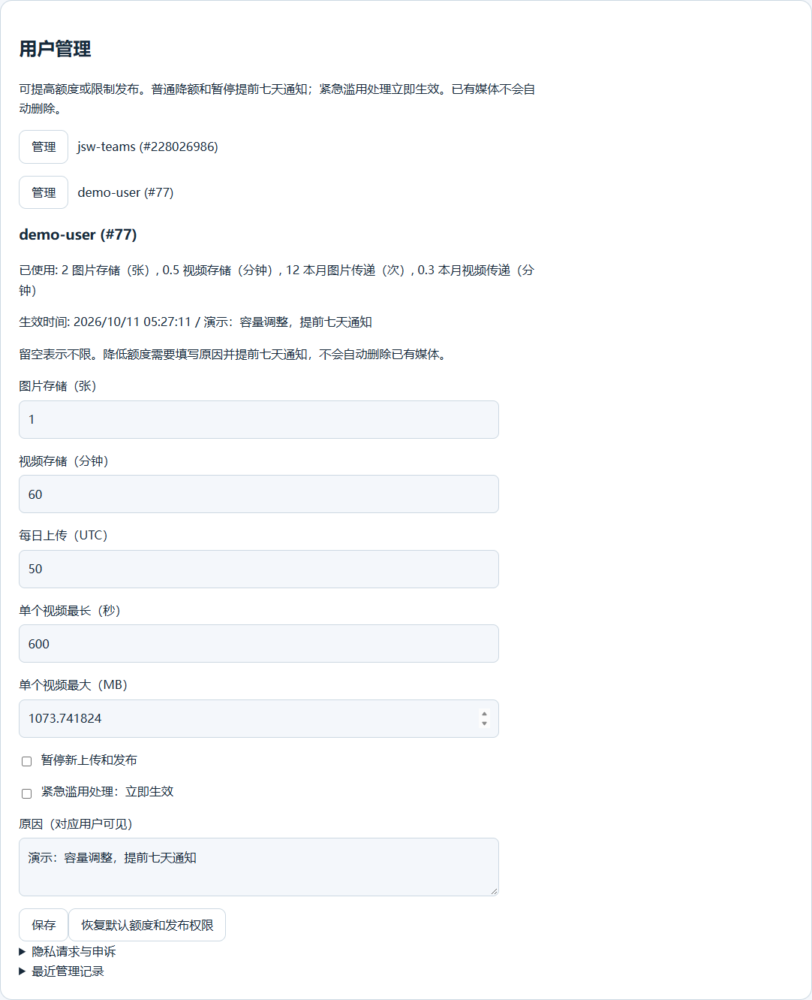

# ishare 中文说明

ishare 用于公开分享图片、视频和配文。发布者使用 GitHub 登录；访客无需登录即可访问分享页或查看嵌入。内容保留作者与来源署名，不提供付费查看或模糊预览。



## 部署与资源接入

使用 Node 24，执行 `npm ci`、`npm run build`、`npm test`、`npm run deploy`。后端代码位于 `/backend/cloudflare`。Worker 保存配置并通过一个 SQLite Durable Object 保存业务资料；Images 和 Stream 通过 **API Token** 接入，可以分别使用不同 Cloudflare 账户。没有 Images/Stream 的 Worker binding。

在 Worker 的 Secrets 中分别配置 `IMAGES_ACCOUNT_ID`、`IMAGES_API_TOKEN`（Images 读写权限），以及 `STREAM_ACCOUNT_ID`、`STREAM_API_TOKEN`（Stream 读写权限）、`STREAM_CUSTOMER_CODE`。只配置图片或视频其中一种也可使用。图片代理使用需要 Bearer Token 的原图下载接口，不要求创建专用变体。视频默认在服务端缓存 Stream 播放令牌；高访问量时可额外配置 Stream 签名密钥，避免播放令牌 API 请求。

GitHub 登录需要 `GITHUB_CLIENT_ID`、`GITHUB_CLIENT_SECRET`，回调地址为 `https://share.js.gripe/auth/callback`。其他服务的 GitHub App 回调不应被自动修改。域名及路由由你自行配置；`workers.dev` 与预览域名关闭。托管 Images/Stream 需要相应的平台计划，一键部署不会提供免费的媒体额度或自动继承其他 Worker 的 Secrets。

## 配额与后台管理

| 普通用户额度 | 默认值 |
| --- | ---: |
| 图片存储 | 1,000 张 |
| 图片传递 | 不设常规额度，后台统计次数 |
| 视频存储 | 60 分钟 |
| 视频传递 | 不设常规额度，后台统计时长 |
| 上传频次 | 每日 50 次 |
| 单个视频 | 最长 10 分钟，最大 1 GiB |

后台按 UTC 日历月统计传递用量，不因普通浏览热度停止分享。视频上传先预留预计时长，发布时改用 Stream 确认的实际时长。传递时长按真实请求的 HLS 分片统计，预加载、重复请求也会记入用量。文件体积仅用于上传检查，不混作视频计费储存额度。

运营者 GitHub 数字 ID 配置为 `OWNER_GITHUB_ID=228026986`，免除所有应用配额及共享预算限制。不能仅根据用户名认定身份。Cloudflare 的硬性文件与编码限制仍然存在，图片最大 10 MB、视频需小于 30 GB。其他用户提高额度时仍受共享预算控制；请按容量调整 `MAX_IMAGES`、`MAX_VIDEO_SECONDS`、`MAX_UPLOADS_PER_DAY`。

登录后，运营者会看到“用户管理”。可单独提高图片数量、视频储存分钟数、上传频次和单文件规格；图片传递次数及视频传递时长仅用于后台监控，不设常规访客额度。留空表示不限，零表示停止对应的新使用。可暂停新上传与发布、恢复默认额度、查看媒体及删除具体内容。额外管理员用 `ADMIN_IDS` 的数字 ID 配置，他们不会因此自动获得无限额度。

降低配额或普通暂停需要填写对应用户可见的原因，并提前七天在站内通知。已有内容不自动删除；超过新额度时停止继续分配。紧急滥用可明确选择立即暂停，仍保留人工申诉、数据导出、本人删除和隐私请求入口。七天是本站运营规则，**不是 GDPR 规定的配额调整期限**。

隐私请求按一个日历月设置答复期限，后台列出待处理请求。管理员需要实际复核与处理，不能只点“答复”即认定已履行权利请求。账户删除会先停止公开访问，再移除上游媒体及账户资料；删除失败会重试，未知上传需要管理员核对。界面会保持“正在删除”，不能将未完成的删除标成完成。

数据导出提供 JSON 资料与媒体链接，不是原始视频文件备份。普通媒体删除记录最长保留三十天，管理及已答复请求记录最长九十天；账户删除完成时会提前清除关联资料。媒体缓存最长五分钟，第三方自行保存的副本无法召回。隐私联系：**helper@js.gripe**。

完整的计费差异、免费图床参考及 GDPR 运营流程见 [operations.md](operations.md)。这些措施支持 GDPR 权利处理；还需要运营者完成适用法律、处理依据、供应商协议与真实请求处理，不能仅凭代码宣称已认证合规。

## 写文建站页面嵌入

在 `config.yml` 的 `plugins.consent.services` 注册 `provider: oembed` 的 ishare 服务，并填写实际用途、接收方、资料类别、保存时间和隐私页地址。页面 YAML：

```yaml
blocks:
  - columns: 1
    cells:
      - - type: oembed
          integration: ishare
          url: https://share.js.gripe/s/替换为真实分享ID
          title: 图片或视频说明
```

需要访客授权该服务并点击“加载媒体”才发起请求。业务接口固定为 `/api`，操作名和资源 URL 在 HTTP 请求头传递。其他 oEmbed 客户端可使用标准 `/oembed` 发现接口。浏览器播放与查看只看到 `share.js.gripe` 的代理地址，HLS 内部资源也会重写；上传者会看到有时效的一次性上传地址，该地址不是账户凭据或播放地址。
